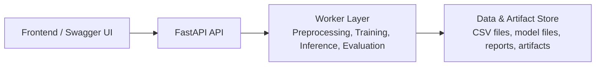

# SOC Intelligence Platform

<<<<<<< HEAD
<<<<<<< HEAD
> AI-powered security operations intelligence for alert triage, model training, and explainable incident classification.

## 🚀 Overview

SOC Intelligence is a machine learning project for security alert classification and incident triage. It combines a modular preprocessing pipeline, multiple model implementations, evaluation utilities, explainability tooling, and a lightweight FastAPI inference service to support experimentation and deployment workflows for SOC use cases.

The repository is organized for end-to-end work across data preparation, model training, inference, and reporting, with local artifacts stored under the project workspace.

## ✨ Features

- FastAPI inference API for serving model predictions
- Modular preprocessing pipeline for loading, cleaning, encoding, splitting, and scaling data
- Support for multiple model families including XGBoost, LightGBM, and TabNet
- Evaluation utilities for triage metrics and performance reporting
- TabNet explainability with feature importance and attention-mask visualizations
- Artifact management for encoders, mappings, scalers, and model assets
- Structured project layout for training, tuning, validation, and reporting workflows

## 🏗️ Architecture



### Flow Summary

- `Frontend`: Currently represented by FastAPI Swagger UI and any future dashboard/client.
- `API`: Receives prediction requests and exposes interactive docs.
- `Worker`: Runs preprocessing, model inference, training, tuning, and evaluation scripts.
- `Database`: In the current project state, storage is file-based under `data/`, `models/`, and `reports/` rather than an external database service.

## 🛠️ Tech Stack

- `Python`
- `FastAPI` + `Pydantic`
- `XGBoost`
- `LightGBM`
- `TabNet / PyTorch`
- `scikit-learn`
- `pandas` and `numpy`
- `matplotlib` and `seaborn`
- `SHAP`

## 📁 Project Structure

```text
.
+-- app.py                  # FastAPI inference entry point
+-- requirements.txt        # Python dependencies
+-- src/
|   +-- data/               # Data loading and splitting
|   +-- preprocessing/      # Cleaning, encoding, scaling, pipeline orchestration
|   +-- models/             # Model-specific training and prediction logic
|   +-- training/           # Training workflows
|   +-- tuning/             # Hyperparameter tuning
|   +-- evaluation/         # Metrics and validation helpers
|   +-- explainability/     # TabNet explainability utilities
|   '-- utils/              # Shared helpers and artifact management
+-- data/                   # Raw and processed datasets
+-- models/                 # Saved model files and preprocessing artifacts
+-- reports/                # Metrics and generated outputs
'-- docs/                   # Supporting technical documentation
```

## ⚙️ Setup

### 1. Clone and create a virtual environment

```bash
git clone <your-repo-url>
cd "SOC Intelligence"
python -m venv .venv
```

Activate the environment:

```bash
# Windows
.venv\Scripts\activate

# macOS / Linux
source .venv/bin/activate
```

### 2. Install backend dependencies

```bash
pip install -r requirements.txt
pip install fastapi uvicorn xgboost lightgbm joblib pytorch-tabnet
```

### 3. Prepare the database / storage layer

This project currently uses local file-based storage instead of an external database.

- Place raw datasets in `data/raw/`
- Saved models live in `models/`
- Preprocessing artifacts are stored in `models/artifacts/`
- Metrics and reports are written to `reports/`

Expected raw dataset paths:

```text
data/raw/GUIDE_Train.csv
data/raw/GUIDE_Test.csv
```

### 4. Frontend setup

There is no separate frontend app in the repository at the moment. For local development, use the built-in FastAPI Swagger UI as the primary interface for testing and exploring the API.

## ▶️ Run Locally

### Start the API

```bash
uvicorn app:app --reload
```

The API will be available at:

- `http://127.0.0.1:8000`
- `http://127.0.0.1:8000/docs`

### Run supporting workflows

Depending on your use case, you can also execute standalone scripts for evaluation, explainability, or validation from the project root, for example:

```bash
python evaluation_integration_example.py
python final_validation_evaluation.py
python validate_explainability.py
```

## 📚 API Documentation

Interactive API documentation is automatically available through Swagger UI:

- `GET /docs` for Swagger UI

Once the API is running, open:

```text
http://127.0.0.1:8000/docs
```

## 🔮 Future Improvements

- Add a dedicated frontend dashboard for analysts and SOC operators
- Introduce an external database or feature store for production-scale persistence
- Containerize the API and worker workflows with Docker
- Add background job orchestration for training and batch inference
- Improve dependency management and lock the full runtime stack
- Expand automated tests and CI/CD coverage
- Add authentication, rate limiting, and production deployment configs

## 📝 Notes

- The repository already includes saved model artifacts and evaluation outputs for experimentation.
- The current architecture is well-suited for local development, research, and iterative model improvement.
- For production deployment, the next step would typically be adding a dedicated worker queue, persistent database, and deployment automation.
=======
SOC incident analysis project with a finalized hybrid modeling pipeline.
=======
Production-style SOC triage demo that combines a FastAPI ML backend with a React analyst console. The system scores preprocessed security alert feature vectors with XGBoost, LightGBM, or TabNet, surfaces real evaluation metrics, and supports a triage-to-remediation workflow.
>>>>>>> main

## What It Demonstrates

- **Multi-model inference**: runtime model selection for XGBoost, LightGBM, and TabNet.
- **Real backend integration**: React calls FastAPI endpoints for prediction, health, metrics, remediation, and processed demo samples.
- **Preprocessing contract**: frontend sends only numeric preprocessed feature arrays; preprocessing artifacts stay backend-side.
- **Analytics dashboard**: model accuracy, macro F1, per-class metrics, confusion matrix, and class distribution from saved evaluation outputs.
- **SOC workflow**: run a prediction, add it to the triage queue, inspect probabilities, and send selected alerts to remediation.
- **Demo-ready samples**: backend can serve rows directly from `data/processed/v1/X_test.csv` for repeatable testing.

## Architecture

```text
React + Vite frontend
  -> /predict
  -> /metrics
  -> /sample-features
  -> /remediation-predict
FastAPI backend
  -> saved ML models
  -> processed datasets
  -> evaluation reports
```

Key paths:

- `app.py`: FastAPI inference API.
- `soc-frontend/`: React SOC console.
- `models/`: saved triage and remediation models.
- `models/artifacts/`: preprocessing artifacts.
- `data/processed/v1/`: preprocessed train/validation/test feature files.
- `reports/metrics/`: saved model evaluation metrics.
- `tests/`: lightweight backend API tests.

## Tech Stack

- Backend: FastAPI, Pydantic, NumPy, pandas, scikit-learn, joblib.
- ML: XGBoost, LightGBM, PyTorch TabNet, classical scikit-learn remediation models.
- Frontend: React, TypeScript, Vite, Tailwind CSS, Recharts.
- Testing: pytest, FastAPI TestClient.

## Setup

```powershell
cd "C:\Users\malty\Projects\SOC Intelligence"
python -m venv .venv
.\.venv\Scripts\python.exe -m pip install --upgrade pip
.\.venv\Scripts\python.exe -m pip install -r requirements.txt

cd soc-frontend
npm install
```

Optional frontend API override:

<<<<<<< HEAD
- Triage and remediation are intentionally separated now.
- `endpoint_response` remains the weakest label because it is low-signal and has very few positive incidents.
- The project is best understood as a hybrid system, not a single-model system.
>>>>>>> origin/main
=======
```powershell
Copy-Item .env.example .env
```

## One-Command Demo

From the project root:

```powershell
.\run_demo.bat
```

This starts:

- FastAPI backend at `http://localhost:8000`
- React frontend at `http://localhost:5173`
- Browser opens automatically

Stop both services with `Ctrl+C`.

## Manual Run

Backend:

```powershell
cd "C:\Users\malty\Projects\SOC Intelligence"
.\.venv\Scripts\python.exe -m uvicorn app:app --host 0.0.0.0 --port 8000 --reload
```

Frontend:

```powershell
cd "C:\Users\malty\Projects\SOC Intelligence\soc-frontend"
npm run dev -- --host 0.0.0.0
```

## Demo Flow

1. Open the frontend and go to **Triage**.
2. Choose a model: XGBoost, LightGBM, or TabNet.
3. Click **Load processed test row** to fetch a real 44-feature row from `X_test.csv`.
4. Click **Run Prediction**.
5. Add the result to the triage queue.
6. Open the queued prediction and send it to remediation.
7. Visit **Analytics** to show real `/metrics` evaluation graphs.

## API

- `GET /health`: backend and model loading status.
- `POST /predict`: score a preprocessed numeric feature vector.
- `GET /sample-features`: return a real processed feature row for demo/testing.
- `POST /remediation-predict`: score incident-level remediation needs.
- `GET /metrics`: return saved evaluation metrics.
- `POST /evaluate`: return saved evaluation metrics with source metadata.

Prediction request:

```json
{
  "features": [0.1, 0.2, 0.3],
  "model": "lightgbm"
}
```

Prediction response:

```json
{
  "prediction": 1,
  "probabilities": [0.05, 0.91, 0.04],
  "model": "lightgbm"
}
```

## Testing

Backend:

```powershell
cd "C:\Users\malty\Projects\SOC Intelligence"
.\.venv\Scripts\python.exe -m pytest
```

Frontend:

```powershell
cd "C:\Users\malty\Projects\SOC Intelligence\soc-frontend"
npm run typecheck
npm run build
```

## Screenshots

Add final screenshots before publishing:

- `docs/screenshots/dashboard.png`
- `docs/screenshots/triage.png`
- `docs/screenshots/analytics.png`
- `docs/screenshots/remediation.png`

## Notes

- The frontend intentionally does not preprocess raw CSVs.
- Raw GUIDE data belongs in the preprocessing pipeline, not `/predict`.
- TabNet requires `pytorch-tabnet`; install `requirements.txt` before demoing all three models.
- Large raw datasets are ignored by git. Keep saved models and processed demo data available for local demos.
>>>>>>> main
